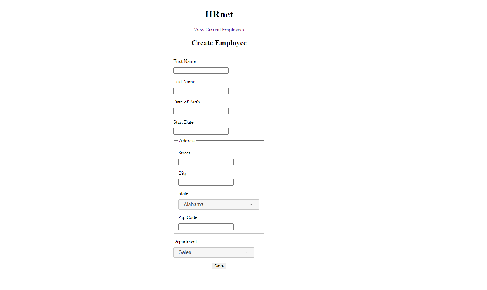
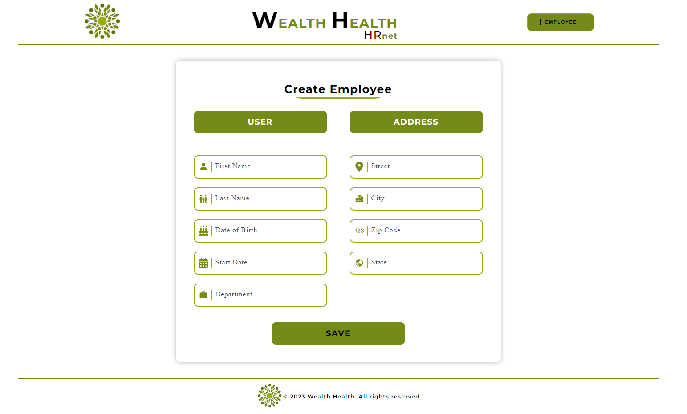

# Wealth Health - OCR

Project de formation chez OpenClassRoom.

# Langage solicité

- SASS
- REACT
- REDUX

# Objectif

- Analyser la performance d'une application web
- Déployer une application front-end
- Refondre une application pour réduire la dette technique
- Mettre en place son environnement Front-End
- Produire de la documentation technique pour une application

# Visiter

[Voir le Rendu](https://nerion-1337.github.io/Wealth_Health-OCR/)

# Aperçu AFTER

# Aperçu BEFORE

